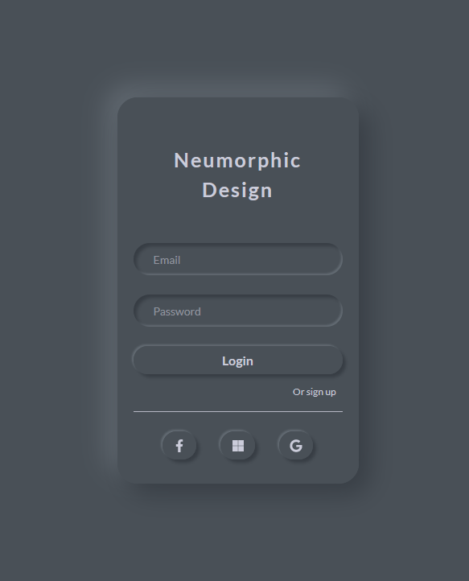
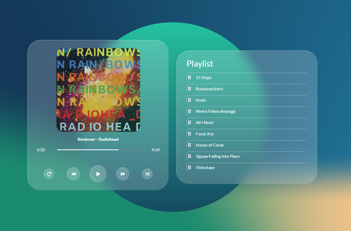

# Frontend playground

Simple html/css designs just for fun.

Run `npm install` to get the dependencies.

### Neumorphic login

### Glassmorphic music player
This one runs pretty bad on Firefox due to that `backdrop-filter: blur();` in not reeeeally available yet. But works great on Chrome, which makes me kind of angry, because I use Firefox.

